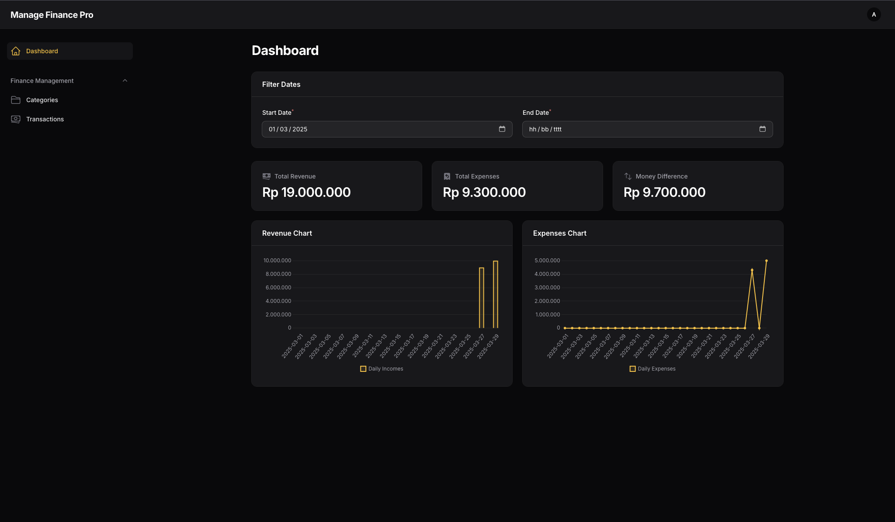
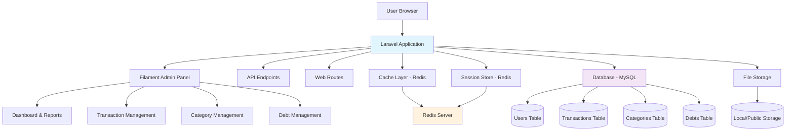

# FinanSphere

[](https://laravel.com)
[](https://php.net)
[](https://mysql.com)
[](https://redis.io)
[](https://filamentphp.com)

FinanSphere adalah aplikasi manajemen keuangan pribadi yang powerful dan user-friendly, dibangun dengan teknologi modern untuk memberikan pengalaman terbaik dalam mengelola keuangan Anda. Dengan antarmuka yang intuitif dan performa tinggi, aplikasi ini memungkinkan Anda untuk melacak pemasukan, pengeluaran, hutang, dan menghasilkan laporan keuangan secara real-time.



---

## ✨ Fitur Utama

### 💰 **Manajemen Keuangan Komprehensif**

-   ✅ Pencatatan transaksi pemasukan dan pengeluaran
-   ✅ Kategorisasi transaksi otomatis
-   ✅ Pelacakan hutang dan piutang
-   ✅ Budget planning dan monitoring

### 📊 **Dashboard & Analytics**

-   ✅ Dashboard interaktif dengan visualisasi real-time
-   ✅ Grafik dan chart keuangan yang informatif
-   ✅ Laporan keuangan bulanan/tahunan
-   ✅ Export laporan dalam format PDF/Excel

### 🔒 **Keamanan & Performa**

-   ✅ Enkripsi data sensitif
-   ✅ Proteksi terhadap SQL Injection, XSS, CSRF
-   ✅ Caching dengan Redis untuk performa optimal
-   ✅ Session management yang aman

### 🔗 **Integrasi & Ekstensibilitas**

-   ✅ API endpoints untuk integrasi pihak ketiga
-   ✅ Webhook support untuk notifikasi real-time
-   ✅ Multi-tenant ready untuk enterprise
-   ✅ Plugin system untuk ekstensi fitur

---

## 🏗️ Arsitektur Aplikasi



---

## 🚀 Teknologi Stack

| Komponen               | Teknologi          | Versi | Deskripsi                                    |
| ---------------------- | ------------------ | ----- | -------------------------------------------- |
| **Backend Framework**  | Laravel            | 12.x  | Framework PHP modern dengan fitur enterprise |
| **Admin Panel**        | Filament           | 3.x   | Panel admin yang elegan dan powerful         |
| **Database**           | MySQL              | 8.0+  | Database relasional untuk penyimpanan data   |
| **Cache/Session**      | Redis              | 6.0+  | In-memory data structure store               |
| **Bahasa Pemrograman** | PHP                | 8.4+  | Server-side scripting language               |
| **Frontend**           | Blade/Tailwind CSS | -     | Template engine dan CSS framework            |
| **Queue System**       | Database/Redis     | -     | Asynchronous job processing                  |

---

## 📦 Instalasi & Setup

### 🔧 Prasyarat Sistem

Sebelum menginstall, pastikan sistem Anda memenuhi requirement berikut:

-   **PHP**: 8.4 atau lebih baru
-   **Composer**: 2.x
-   **MySQL**: 8.0 atau lebih baru
-   **Redis**: 6.0 atau lebih baru
-   **Node.js**: 18.x atau lebih baru (untuk asset compilation)
-   **Git**: 2.x

### 📋 Langkah Instalasi

Ikuti langkah-langkah berikut secara berurutan untuk setup aplikasi:

#### 1. **Clone Repository**

```bash
git clone https://github.com/Halfirzzha/FinanSphere.git
cd FinanSphere
```

#### 2. **Install PHP Dependencies**

```bash
composer install --no-dev --optimize-autoloader
```

#### 3. **Setup Environment Configuration**

```bash
cp .env.example .env
```

Edit file `.env` dan sesuaikan konfigurasi database, Redis, dan environment settings.

#### 4. **Generate Application Key**

```bash
php artisan key:generate
```

#### 5. **Setup Database**

```bash
# Buat database di MySQL terlebih dahulu
# Kemudian jalankan migrasi
php artisan migrate

# (Opsional) Jalankan seeder untuk data dummy
php artisan db:seed
```

#### 6. **Setup Redis**

```bash
# Pastikan Redis server berjalan
redis-cli ping  # Harus return PONG

# Install PHP Redis extension jika belum ada
pecl install redis
```

#### 7. **Compile Assets** (untuk production)

```bash
npm install
npm run build
```

#### 8. **Cache Configuration** (untuk performa optimal)

```bash
php artisan config:cache
php artisan route:cache
php artisan view:cache
```

#### 9. **Setup Storage Link**

```bash
php artisan storage:link
```

#### 10. **Jalankan Aplikasi**

```bash
# Untuk development
php artisan serve

# Atau gunakan Laravel Sail (Docker)
./vendor/bin/sail up
```

#### 11. **Akses Aplikasi**

Buka browser dan akses:

```
http://127.0.0.1:8000
```

---

## 🔧 Konfigurasi Environment

### Development Mode

```env
APP_ENV=local
APP_DEBUG=true
CACHE_STORE=redis
SESSION_DRIVER=redis
LOG_LEVEL=error
```

### Production Mode

```env
APP_ENV=production
APP_DEBUG=false
CACHE_STORE=redis
SESSION_DRIVER=redis
LOG_LEVEL=warning
APP_URL=https://yourdomain.com
```

---

## 🐛 Troubleshooting

### Masalah Umum dan Solusinya

#### ❌ **Redis Connection Failed**

```bash
# Cek Redis server
redis-cli ping

# Restart Redis service
brew services restart redis

# Cek konfigurasi Redis di .env
REDIS_HOST=127.0.0.1
REDIS_PORT=6379
```

#### ❌ **Database Connection Error**

```bash
# Cek kredensial database di .env
DB_CONNECTION=mysql
DB_HOST=127.0.0.1
DB_PORT=3306
DB_DATABASE=your_database
DB_USERNAME=your_username
DB_PASSWORD=your_password

# Test koneksi database
php artisan tinker
DB::connection()->getPdo();
```

#### ❌ **Permission Issues**

```bash
# Set permission untuk storage dan bootstrap/cache
chmod -R 755 storage bootstrap/cache
chown -R www-data:www-data storage bootstrap/cache
```

#### ❌ **Composer Install Failed**

```bash
# Clear composer cache
composer clear-cache

# Update composer
composer self-update

# Install dengan verbose output
composer install -vvv
```

---

## 📂 Struktur Proyek

```
FinanSphere/
├── app/                          # Core application logic
│   ├── Console/                  # Artisan commands
│   ├── Http/                     # HTTP layer (Controllers, Middleware)
│   ├── Models/                   # Eloquent models
│   ├── Providers/                # Service providers
│   └── Filament/                 # Admin panel resources
├── bootstrap/                    # Application bootstrap
├── config/                       # Configuration files
├── database/                     # Database migrations & seeders
│   ├── migrations/               # Database schema
│   ├── factories/                # Model factories
│   └── seeders/                  # Database seeders
├── public/                       # Public web assets
├── resources/                    # Frontend resources
│   ├── css/                      # Stylesheets
│   ├── js/                       # JavaScript files
│   └── views/                    # Blade templates
├── routes/                       # Route definitions
├── storage/                      # File storage & cache
│   ├── app/                      # Application files
│   ├── framework/                # Framework cache
│   └── logs/                     # Application logs
├── tests/                        # Test files
├── vendor/                       # Composer dependencies
├── .env.example                  # Environment template
├── artisan                       # Laravel CLI
├── composer.json                 # Composer configuration
├── package.json                  # NPM configuration
├── phpunit.xml                   # PHPUnit configuration
└── vite.config.js               # Vite configuration
```

---

## 🧪 Testing

```bash
# Jalankan semua test
php artisan test

# Jalankan test dengan coverage
php artisan test --coverage

# Jalankan specific test
php artisan test tests/Feature/ExampleTest.php
```

---

## 🚀 Deployment

### Menggunakan Laravel Forge / Vapor

1. Push kode ke repository
2. Setup server di Laravel Forge
3. Configure environment variables
4. Deploy menggunakan auto-deployment

### Manual Deployment

```bash
# Clone ke server production
git clone https://github.com/Halfirzzha/FinanSphere.git
cd FinanSphere

# Install dependencies
composer install --no-dev --optimize-autoloader
npm install && npm run build

# Setup environment
cp .env.example .env
# Edit .env untuk production

# Generate key dan cache
php artisan key:generate
php artisan config:cache
php artisan route:cache
php artisan view:cache

# Migrate database
php artisan migrate --force

# Setup queue worker (jika menggunakan queue)
php artisan queue:work --daemon
```

---

## 🤝 Contributing

Kami sangat menghargai kontribusi Anda! Berikut adalah panduan untuk berkontribusi:

1. Fork repository ini
2. Buat branch fitur baru (`git checkout -b feature/AmazingFeature`)
3. Commit perubahan (`git commit -m 'Add some AmazingFeature'`)
4. Push ke branch (`git push origin feature/AmazingFeature`)
5. Buat Pull Request

### 📋 Pull Request Guidelines

-   Pastikan kode Anda mengikuti PSR-12 coding standard
-   Tambahkan test untuk fitur baru
-   Update dokumentasi jika diperlukan
-   Pastikan semua test pass

---

## 🙏 Acknowledgments

-   [Laravel](https://laravel.com) - The PHP Framework for Web Artisans
-   [Filament](https://filamentphp.com) - The elegant TALL stack admin panel
-   [Redis](https://redis.io) - In-memory data structure store
-   [MySQL](https://mysql.com) - World's most popular open source database
